# Text to Process Model - System Design

Complete system architecture, workflows, and technical design for the BPMN generation platform.

## Table of Contents

1. [System Overview](#system-overview)
2. [Architecture](#architecture)
3. [Data Flow](#data-flow)
4. [Component Design](#component-design)
5. [API Design](#api-design)
6. [Database Schema](#database-schema)
7. [Deployment Architecture](#deployment-architecture)
8. [Security Design](#security-design)

---

## System Overview

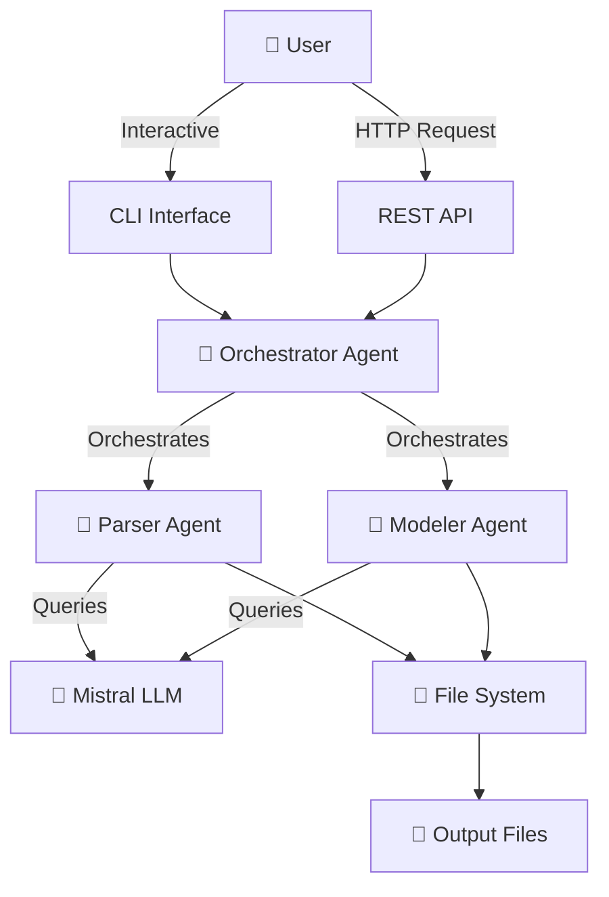

---

## Architecture

### High-Level Architecture

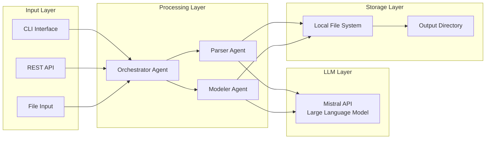

### Component Interaction Diagram

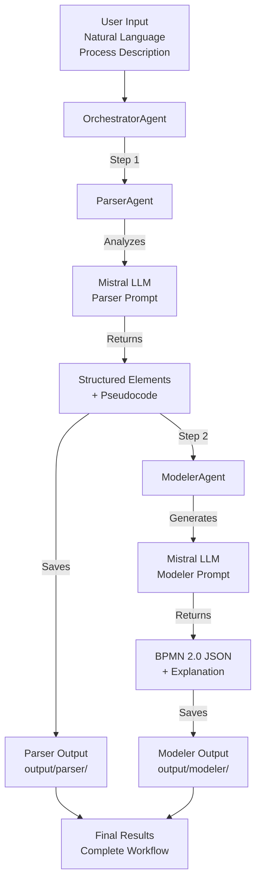

---

## Data Flow

### End-to-End Process Flow

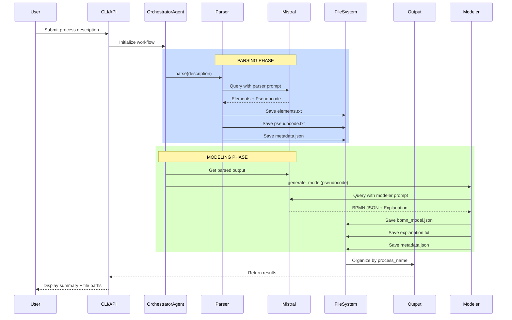

### REST API Request/Response Flow

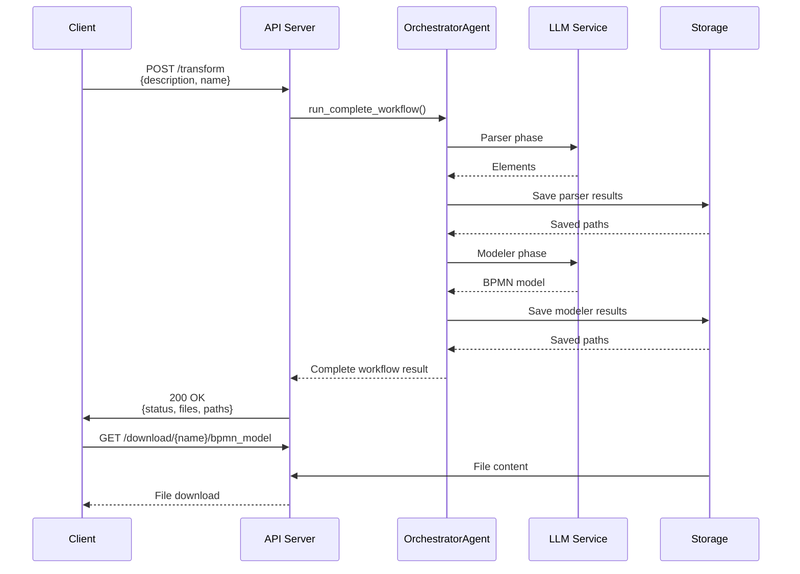

---

## Component Design

### Parser Agent

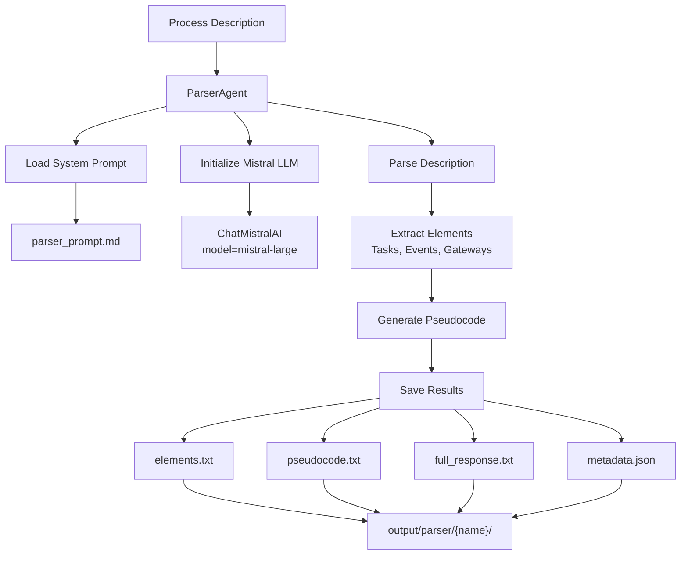

### Modeler Agent

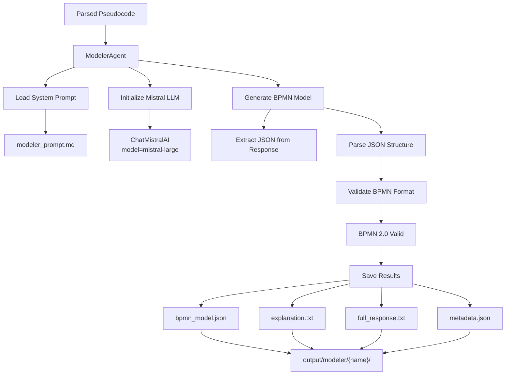

### Orchestrator Agent Orchestrator

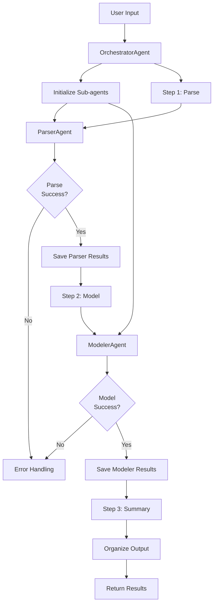

---

## API Design

### REST API Architecture

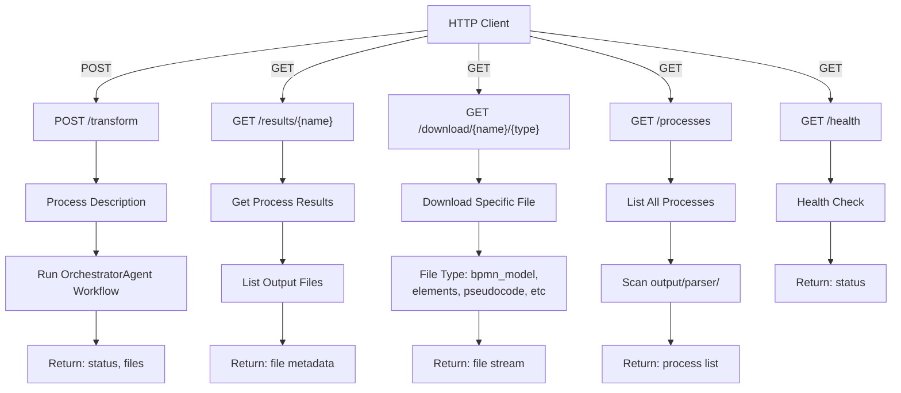

### API Request/Response Models

```
ProcessTransformRequest:
├── process_description: str (min 10 chars)
├── process_name: str (min 1, max 100)
└── api_key: Optional[str]

ProcessingResult:
├── status: "success" | "error"
├── process_name: str
├── process_description: str
├── parser_status: str
├── modeler_status: str
├── files: Dict[FileInfo]
├── timestamp: str
└── error: Optional[str]

FileInfo:
├── filename: str
├── path: str
├── size: int
└── content_preview: Optional[str]
```

---

## Database Schema

### File System Organization

```
project_root/
├── output/
│   ├── parser/
│   │   └── {process_name}/
│   │       ├── elements.txt
│   │       ├── pseudocode.txt
│   │       ├── full_response.txt
│   │       ├── metadata.json
│   │       └── output.json
│   │
│   └── modeler/
│       └── {process_name}/
│           ├── bpmn_model.json
│           ├── explanation.txt
│           ├── full_response.txt
│           ├── metadata.json
│           └── output.json
│
├── config/
│   └── settings.py
├── agents/
│   ├── parser_agent.py
│   ├── modeler_agent.py
│   └── orchestrator_agent.py
├── prompts/
│   ├── parser_prompt.md
│   └── modeler_prompt.md
├── utils/
│   ├── file_handler.py
│   ├── json_parser.py
│   ├── text_formatter.py
│   └── error_handler.py
├── api/
│   └── server.py
└── main.py
```

### Metadata JSON Structure

```json
{
  "parser_metadata": {
    "model": "mistral-large-latest",
    "temperature": 0.2,
    "api_key_set": true,
    "usage": {
      "input_tokens": 1234,
      "output_tokens": 567
    }
  },
  "process_info": {
    "process_name": "customer_inquiry",
    "elements_count": 8,
    "pseudocode_lines": 12
  },
  "timestamp": "2024-01-15T10:30:00",
  "status": "success"
}
```

---

## Deployment Architecture

### Local Development Setup

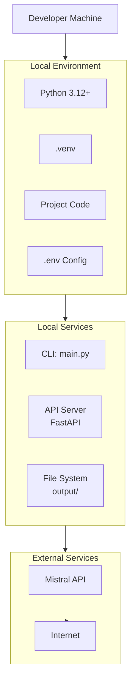

### Production Deployment (Docker)

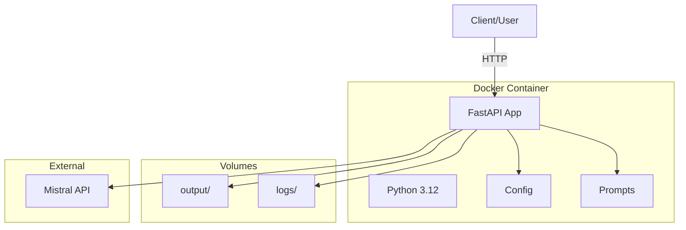

---

## Security Design

### Security Layers

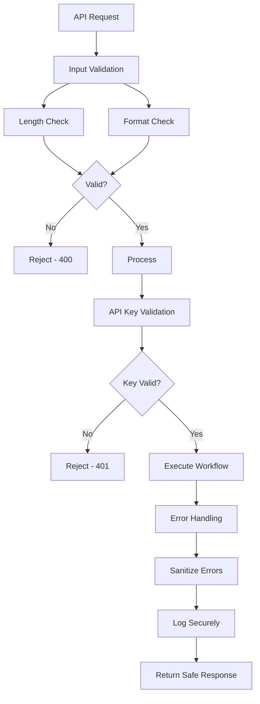

### Environment & Secrets

```
.env (git-ignored):
├── MISTRAL_API_KEY
├── API_PORT
└── DEBUG_MODE

.env.example (git-tracked):
├── MISTRAL_API_KEY=your-key-here
├── API_PORT=8000
└── DEBUG_MODE=false
```

---

## Error Handling & Logging

### Error Flow

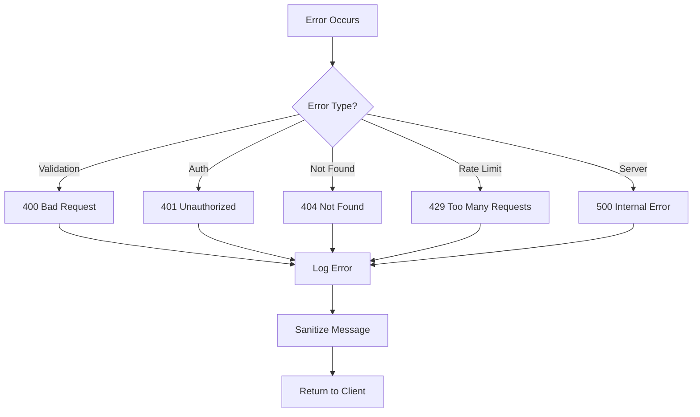
---

## Technology Stack

| Layer | Technology |
|-------|-----------|
| **Language** | Python 3.12+ |
| **CLI Framework** | argparse |
| **Web Framework** | FastAPI + Uvicorn |
| **LLM** | Mistral AI |
| **LLM Client** | LangChain |
| **Request Library** | httpx |
| **Data Validation** | Pydantic |
| **Testing** | pytest |
| **Linting** | ruff |
| **Formatting** | black |
| **Package Manager** | uv |
| **Containerization** | Docker (future) |

---

## Summary

This system design provides:
- ✅ Clear separation of concerns
- ✅ Scalable architecture
- ✅ Security-first approach
- ✅ Comprehensive error handling
- ✅ Multiple input/output methods
- ✅ Production-ready design
- ✅ Clear deployment path